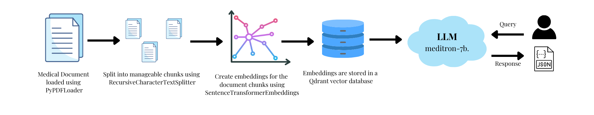
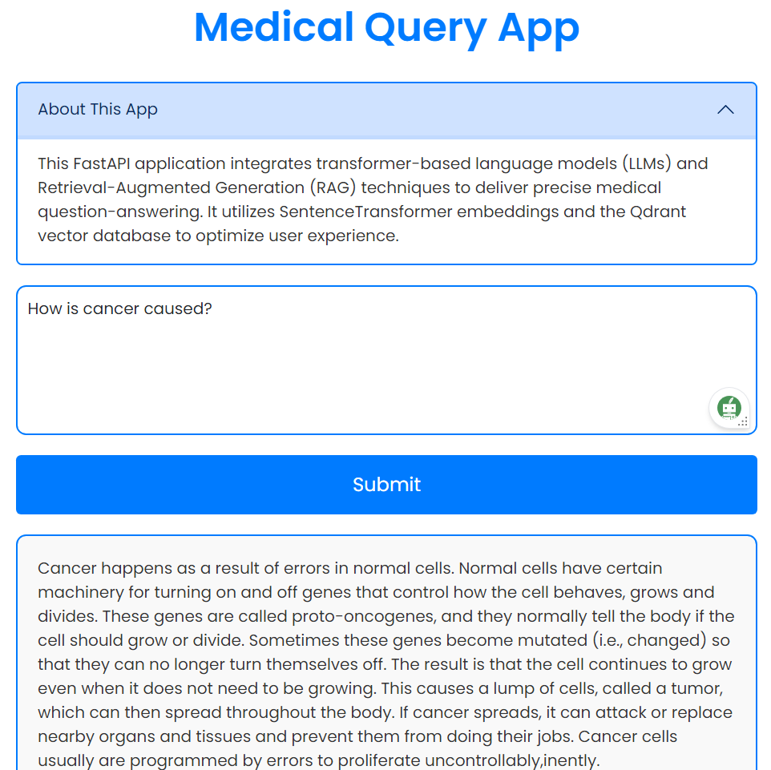

# Medical RAG-using-Meditron-7B-LLM
Oncology RAG Q&A App using Meditron 7B LLM, Qdrant Vector Database, and PubMedBERT Embedding Model.



# Medical RAG QA App

## Description

This FastAPI application integrates transformer-based language models (LLMs) and Retrieval-Augmented Generation (RAG) techniques to deliver precise medical question-answering. It utilizes SentenceTransformer embeddings and the Qdrant vector database to optimize user experience.

## Data Ingestion of PDF Documents

## Steps to Run

### 1. Setup and Data Ingestion

Before running the ingestion script, ensure Docker is installed and running on your machine.

1. **Download Qdrant Image**:
    ```sh
    docker pull qdrant/qdrant
    ```

2. **Run Qdrant Container**:
    ```sh
    docker run -p 6333:6333 qdrant/qdrant
    ```

3. **Ingest Data**:
    After setting up Qdrant, run `ingest.py` to create a vector database in Qdrant. Vectors are ingested into Qdrant via its API.
    ```sh
    python ingest.py
    ```

### 2. Semantic Similarity Search

Use `retriever.py` to perform semantic similarity search on a Qdrant vector database using sentence embeddings.

1. **Run the Retriever**:
    ```sh
    python retriever.py
    ```

### 3. RAG Application

Ensure you are logged into Hugging Face to access the necessary models.

1. **Login to Hugging Face**:
    ```sh
    huggingface-cli login
    ```
    Log in using the write token generated in your Hugging Face account.

    or directly **Download** the model from Hugging Face - meditron-7b-Q4_K_M-GGUF
2. **Run the RAG Application**:
    From the `src` folder, start the FastAPI application using Uvicorn:
    ```sh
    uvicorn rag:app
    ```

## File Overview

- **ingest.py**: Ingests PDF documents and creates vector embeddings using SentenceTransformers. The vectors are stored in the Qdrant vector database.
- **retriever.py**: Uses LangChain to perform semantic similarity searches on the Qdrant vector database using sentence embeddings.
- **rag.py**: Implements the RAG (Retrieval-Augmented Generation) application using FastAPI. Connects to the Qdrant server using the specified URL.

## Output



## Additional Notes

- Ensure Docker is installed and running before starting the Qdrant container.
- Ensure you have the necessary permissions and tokens for Hugging Face.

## Conclusion

This application leverages cutting-edge AI technologies to provide precise and efficient medical question-answering. By integrating LLMs, RAG, SentenceTransformer embeddings, and the Qdrant vector database, it ensures optimized performance and user experience.
